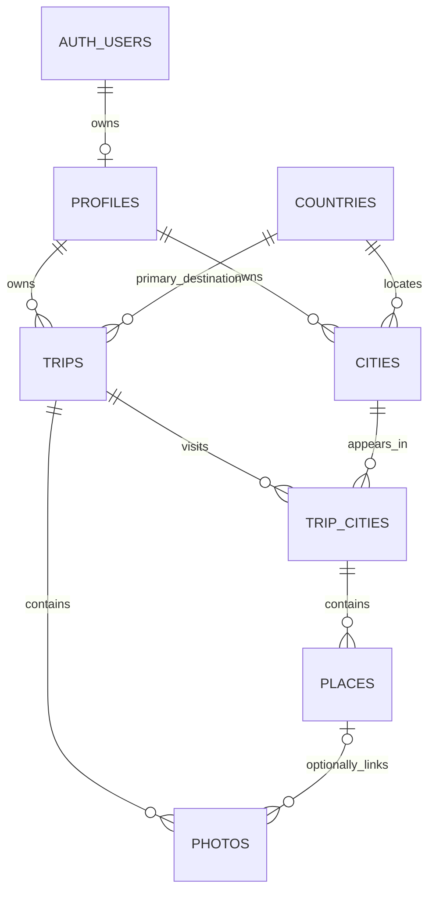

# Travel data model — Step 6

## Status and application

The migration is tested locally in PGlite (PostgreSQL compiled to WebAssembly).
The project owner applied it to hosted Supabase and confirmed successful catalog
verification on 2026-10-02: seven tables, all with RLS enabled and zero policies.
The one-time Step 6 verification script was removed after that confirmation;
the migration and automated schema tests remain part of the repository.
The publishable key cannot execute migrations; use the project's SQL Editor as
the database owner. No database password or privileged key belongs in the app.

1. Open the **travel-memory-map** project, then **SQL Editor → New query**.
2. Paste the full contents of
   `supabase/migrations/20261001000000_initial_travel_schema.sql` and run once.
3. On a fresh project, confirm all seven tables exist with RLS enabled and no
   policies or application grants. Then continue with the Step 7 policies.

These instructions are for recreating the database, not reapplying the migration
to the already configured project.

The migration uses a transaction and requires PostgreSQL 15+. It intentionally
fails if these tables already exist instead of silently accepting schema drift.
Do not rerun it after success or drop tables to resolve a conflict. Report any
error and inspect the existing schema first. Step 7 intentionally adds grants
and policies, so the initial zero-policy state applies only at the end of Step 6.

The ordered migration file is the schema source of truth. SQL Editor application
does not update Supabase CLI migration history. If adopting `supabase db push`
later, verify the hosted schema and mark this exact version applied with
`supabase migration repair 20261001000000 --status applied` on the linked project
before pushing future migrations. Do not execute both application paths blindly.

## Relationships



| Table | Purpose and main fields |
| --- | --- |
| `countries` | Global reference: two-letter country `code`, `name`, `continent_code` |
| `profiles` | User profile: `id` references `auth.users.id`, optional `display_name` |
| `cities` | User's reusable city: `user_id`, `country_code`, `name`, `region`, coordinates |
| `trips` | Specific journey: owner, title, primary country, dates, description, notes, optional cover photo |
| `trip_cities` | Trip/city association: owner, trip, city, display `sort_order` |
| `places` | Trip-specific visit: trip city, name, category, coordinates, optional `visited_on`, notes |
| `photos` | Owner, trip, optional place, unique `storage_path`, caption |

All user-owned tables have `created_at` and `updated_at` timestamps. Updates
preserve `created_at` and refresh `updated_at` automatically. Countries are
reference data, not a user's visited-country list. Populate the reference data
in the seed step; no personal data is included in this migration.

## Identity and ownership

UUIDs identify trips and visits, so identical titles/dates never prevent repeat
trips. A city is unique per user, country, normalized name, and normalized region
(trimmed, case-insensitive). Region disambiguates same-name cities. The UI must
reuse canonical city IDs; alternate spellings/renames are not auto-geocoded.

A city may appear in many trips, but only once per trip. Places are specific
visits, not a global POI catalog: the same landmark may have separate records in
different trips. The same city name can exist independently for different users.

Composite foreign keys enforce owner consistency through trip → city visit →
place → photo. A photo may only reference a place from its own trip and owner.
A trip cover must be a photo from that trip. Application validation and Step 7
RLS add access control; foreign keys provide structural integrity.

An account's profile is not automatically created yet. Step 8 will implement
profile provisioning with authentication; seed scripts must insert a profile
before inserting owned data. This migration does not add an Auth trigger.

## Countries, map, and statistics

Every trip has a primary country, even before its cities are added. Additional
countries derive from its cities, allowing multi-country trips. Visited countries
are the distinct union of trip primary countries and linked-city countries.
Visited cities count distinct linked city IDs, not unused saved cities or raw
`trip_cities` rows. Most-visited counts distinct trips per destination.

Map coordinates come from cities/places, not photos. At world/country level a
trip's first city (`sort_order`, then ID for ties) can anchor its marker; a trip
without cities can use its country geometry. Do not store duplicate trip counts
or map coordinates in summary columns.

Trip duration is `end_date - start_date + 1` (inclusive calendar days, one-day
trips count as 1). Dates use PostgreSQL `date`; audit timestamps use `timestamptz`.
Trips per year use start-date year. Continents derive from countries using seven
codes: AF, AN, AS, EU, NA, OC, SA. A country's assigned continent is a reference
data convention. The world-explored denominator must be documented with the
complete country dataset in the statistics/seed steps, not hardcoded here.

Finite trip dates and end ≥ start are enforced. Place dates are optional manual
notes; they are not constrained to trip dates in SQL. A future form can warn about
out-of-range dates without introducing cross-table date triggers. Coordinates
are required for cities and places and constrained to valid latitude/longitude
ranges. Sort order is a display preference, not itinerary planning.

## Photos and deletion

Store paths such as `USER_UUID/TRIP_UUID/PHOTO_UUID.jpg` in the future private
`travel-photos` bucket. Store neither public/signed URLs nor EXIF, GPS, capture
timestamps, or arbitrary photo metadata. Signed URLs are generated on demand
when Storage is implemented. `created_at` records upload-record creation, not
the date the photo was taken.

| Deletion | Database behavior |
| --- | --- |
| Place | Photos survive; their `place_id` becomes null |
| Trip city | Its places are removed; their photos stay with the trip, unlinked |
| Photo | A trip using it as cover has `cover_photo_id` cleared |
| Trip | Its city associations, places, and photo records cascade; reusable cities remain |
| City still used by trips | Rejected at transaction commit; remove visits first |
| Auth user/profile | Owned cities, trips, visits, places, and photo records cascade |
| Country in use | Rejected |

The city reference is deferred until commit so account deletion can cascade
cities and trips together. Other associations check immediately unless explicitly
deferred. Cover assignment follows photo insertion.

**SQL cascades delete metadata only.** Future photo/trip/account deletion must
coordinate Storage API removal and database cleanup, with retry handling. Never
delete rows from `storage.objects` directly. No bucket exists from this migration.

## Access and tests

RLS is enabled on all seven tables immediately, with no policies. Privileges are
revoked from PUBLIC, anon, and authenticated. Therefore even countries cannot be
read through the Data API yet. Step 7 adds minimal authenticated grants and owner
policies, plus read-only country reference access. Do not disable RLS to test UI.

```sh
npm run test:db
```

Tests apply the exact migration to a fresh in-memory PostgreSQL engine, create
two fictional owners, and verify constraints, repeat visits, cross-owner/trip
rejection, cascades, timestamps, and initial access restrictions. Minimal
`auth.users` and role fixtures simulate only migration dependencies. They do not
replace hosted verification, real Auth, Storage, or Step 7 RLS integration tests.
No environment file or network is used. Fixtures disappear when the process ends.

Generated Supabase TypeScript types will be taken from the applied hosted schema
when database queries are introduced; this step does not maintain hand-written
copies of generated types.

References: [Supabase user data](https://supabase.com/docs/guides/auth/managing-user-data),
[RLS](https://supabase.com/docs/guides/database/postgres/row-level-security),
[PostgreSQL constraints](https://www.postgresql.org/docs/16/ddl-constraints.html).
